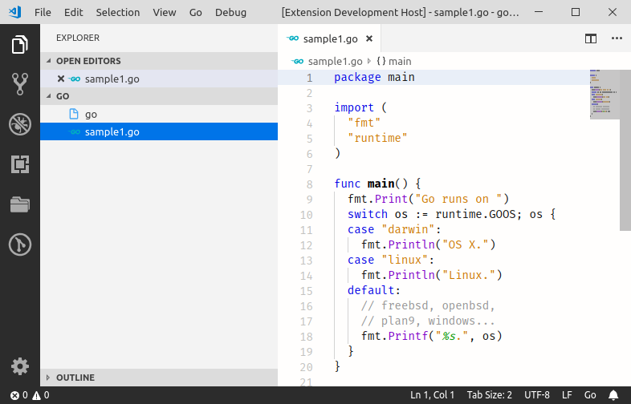
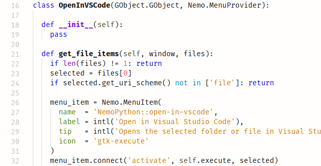
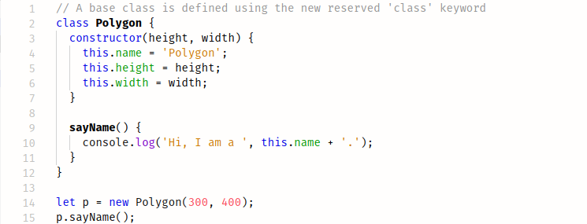
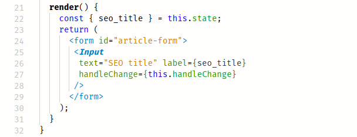
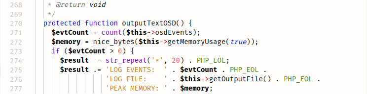

# Good Taste Theme

A light theme with sober and carefully chosen colors for long hours usage.
Better suitable for well illuminated environments.

I hope you like it. Feedback is welcome!

Dark version: [**Dark Taste Theme**](https://marketplace.visualstudio.com/items?itemName=faelv.dark-taste-theme)

Font used: [**Fira Mono**](https://mozilla.github.io/Fira/)

## Supported languages:

- **CSS**
- **Go**
- **HTML**
- **JavaScript ( +React )**
- **JSON**
- **PHP**
- **Python**
- **Pug**
- **Sass / SCSS**
- **SQL**
- **TypeScript ( +React )**

Other languages may work too, even without specific support.

## Screenshots:

### Python

### JS

### JSX / React

### PHP

## Support

If something isn't working open an issue [here](https://github.com/faelv/good-taste-theme/issues).

Usually no one bothers to do it, but if you liked this extension consider leaving a rating and/or review, it means a lot to me.

#

This theme was inspired by [Netbeans Light Theme by Ondrej Brejla](https://github.com/obrejla/vscode-netbeans-light-theme)
