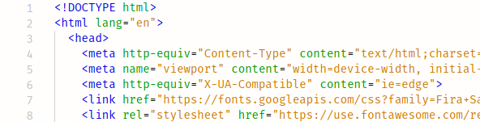
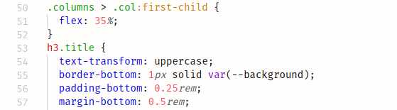
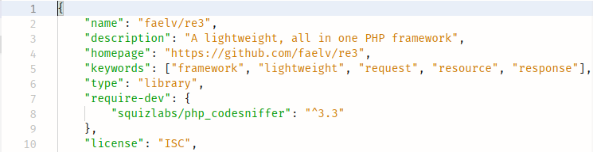

# Good Taste Theme

I don't like dark themes, can't stare at then for too long, so while searching for a good light theme the only
one I found was the [Netbeans Light Theme by Ondrej Brejla](https://github.com/obrejla/vscode-netbeans-light-theme) which
misses support for PHP, so I took it and used it as a base for this one with a few UI tweaks and support for PHP, SQL
and others.

Supported languages:
- PHP
- SQL
- JavaScript
- JSON
- JavaScript React / JSX
- TypeScript
- HTML
- Pug
- CSS
- Sass / SCSS
- Go

To install type `ext install faelv.good-taste-theme` in VS Code's Quick Open (Ctrl+P) and hit Enter, or search for Good
Taste Theme.

Font is [**Fira Mono**](https://mozilla.github.io/Fira/)

## PHP

## JS

## JSX / React

## HTML

## CSS

## JSON

**I hope you like it**
